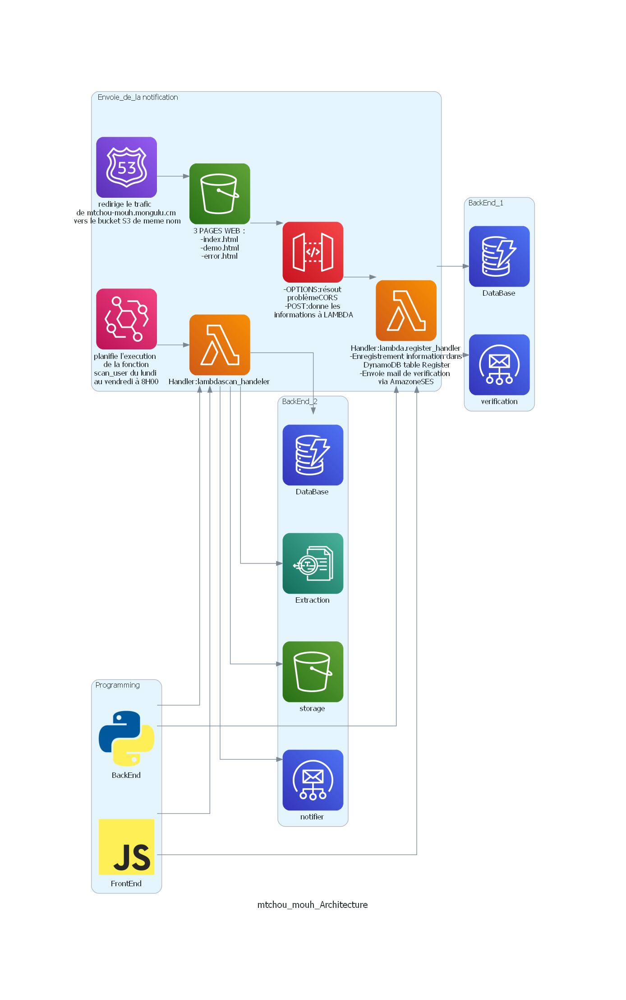

# Mtchoun' mouh
> Langue [Ghomala](https://fr.wikipedia.org/wiki/Ghomala%CA%BC) siginifiant nouvelle/message en français

L'objectif du projet est de vous permettre de revoir une notification immédiatement après la sortie de votre passeport au consulat de Marseille en France.
Si vous souhaitez voir à quoi ça ressemble, rendez-vous à l'adresse suivante: https://mtchoun-mouh.mongulu.cm/

## Contexte fonctionnel

### Comportement actuel

Lorsqu'un usager se rend au consulat du Cameroun à Marseille pour faire sa demande au consulat, il lui est rappelé que pour savoir si son passeport est sorti , il lui faut régulièrement regarder une page du site du [consulat](https://www.consulacam-marseille.fr/index.php?p=consulat-cameroun-passeports). En effet cette page contient tous les communiqués d’arrivée de passeport ordonnées de façon chronologique et débutant par la mention  **Communiqué du dd month year** .
Il faut alors parcourir cette page depuis le début en scrollant jusqu'à une date de communiqué ultérieure à la date de dépôt. C'est qu'il s’agit d’images et non de texte publiés ;impossible donc d’utiliser la fonction de recherche du navigateur.

### Problèmes

* La personne qui a fait sa demande au consulat même si elle peut avoir une vague idée du temps que cela prendra devra néanmoins régulièrement checker le site web pour savoir si celui-ci est sorti ou pas. Il faut donc qu’elle se le garde dans un coin de sa tête.

* Une fois sur le site, même si elle est aidé par le fait que les communiqués sont rangés chronologiquement, elle doit néanmoins parcourir les communiqués ultérieurs à sa demande de visa pour voir si le sien est sorti. Une erreur est donc vite arrivé si l’on est pas concentré .

### Solution proposé
L'usager s'enregistre sur une plateforme via son nom et son adresse email ce qui permettra ensuite de le notifier
automatiquement notifié par email de la sortie de son passeport avec les contraintes suivantes:
    • Pas d’accès au système d’information digitalisé de gestions des passeports de la [DGSN]( https://www.dgsn.cm/?fbclid=IwAR1KmGe-drUBiwpUg_tx-6b-crEPsXrqoPdTK7X8Ik-mag-NG7pUky4zV7U)
    • Pas de possibilité d’influer sur le processus interne de délivrance des passeports au consulat de Marseille

> La solution sera donc externe au services du consulat et la source de donnée le site web du consulat.


## Contexte technique

Si vous êtes ici, c'est que vous intéressez par un déploiement maison de la solution. Suivez le guide :) !

### Architecture

<details><summary>Cliquez sur la flèche pour visualiser </summary>



</details>


### Prérequis

* Avoir un minimum de compétence sur le cloud AWS et Terraform
* Installez localement tous les outils ( il vous suffit d'éxécuter les scripts `init` et `command` du fichier [.gitpod.yml](.gitpod.yml) **ou** utilisez un environnement de développement déjà prêt à l'emploi sur gitpod :

[](https://gitpod.io/#https://github.com/mongulu-cm/mtchoun-mouh)


### Déploiement

* Créez un fichier `.env` à la racine contenant:
  ```
    export TF_VAR_MAINTAINER_MAIL="<votre mail>"
    export TF_VAR_WEBSITE_BUCKET_NAME="<votre sous-domaine>"
    export TF_VAR_IMAGES_BUCKET_NAME="xxxxxxx"
    export AWS_ACCESS_KEY_ID="xxxxxxx"
    export AWS_SECRET_ACCESS_KEY="xxxxx"
  ```
> Vous devez vous assurer que TF_VAR_MAINTAINER_MAIL contient un mail vérifié par Amazon SES

* Ensuite, éxécutez les commandes suivantes:
  ```
    source .env
    terraform init
    terraform apply
    aws s3 cp html/ s3://mtchoun-mouh.mongulu.cm --recursive
  ```

* Enfin, créez une distribution cloudfront et enregistrement DNS mtchoun-mouh.xxxx.yyy pointant vers elle


### Pyramid test

#### Unit tests
  ```
    cd api/
    pytest test_extract.py
    pytest test_notify.py
  ```

#### Integration tests

To launch integration tests locally :
  ```
    act -j <job_name> --secret-file .env
  ```

#### End to end


### Monitoring applicatif

Les services API Gateway et Lambda sauvent des logs dans CloudWatch.   
Le suivi des visites sur le site web se fait grâce à https://fr.matomo.org/ ( alternative opensource à Google Analytics).

### Performance applicative

Il est possible de suivre l'évolution du nombre d'utilisateur enregistré par jour en exploitant le paramètre
`ReturnedItemCount` de la table `Register` dans les graphiques Cloudwatch DynamoDB.

### Couverture du code

#### Infrastructure

Exécutez:
 ```
    driftctl scan --from tfstate+s3://<bucket_name>/terraform.tfstate -o json://drift.json
    driftctl gen-driftignore -i drifts.json >> .driftignore
 ```

Puis supprimez toutes les ressources non liés directement au projet.
Le taux de couverture actuel est de `76%`.

## Comment contribuer ?

Vous avez remarqué un soucis ou vous voulez proposer une amélioration ? N'hésitez pas à ouvrir une issue :) !
